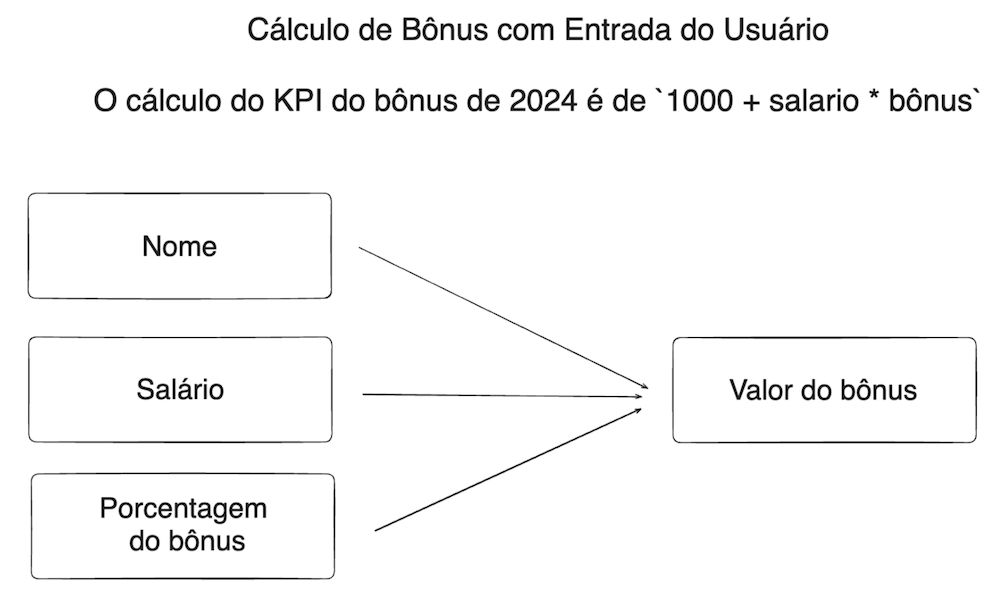

**Aula 01**
   
Esse repositório tem por finalidade publicar os exercícios realizados na Aula 01 do Bootcamp de Python da Jornada de Dados, e também de praticar a utilização do Github.

Primeira proposta do exercício (arquivo desafio.py):

1. Solicitar ao usuário que digite o seu nome e converter a entrada para ponto flutuante.
2. Solicitar ao usuário que digite o valor do seu salário e converter a entrada para ponto flutuante.
3. Solicitar ao usuário que digite o valor do bônus e converte a entrada para ponto flutuante.
4. Calcular o valor do bônus final que será 1000 + valor do salário * valor do bônus.

 

Segunda proposta de exercício:
